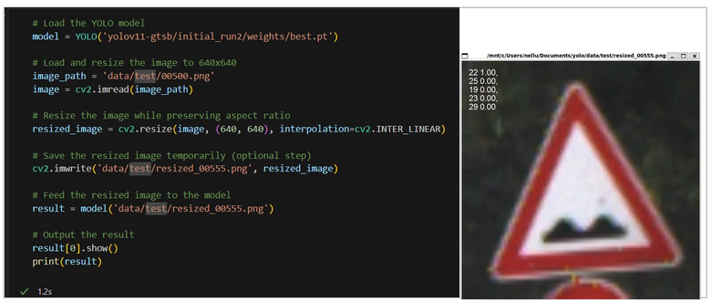

[[_TOC_]]

* [ECE - 5831 Final Project](#ece---5831-final-project)

    * [Overview](#overview)
    * [Dataset](#Dataset)
    * [CNN](#cnn)
    
        * [Pre-processing](#Pre-processing)
        * [Architecture](#Architecture)
    * [YOLOv11](#YOLOv11)
        
        * [Pre-processing](#Pre-processing)
        * [Model Parameters](#model-parameters)
        * [Inferance](#Inferance)
    * [Presentation](#Presentation)
    * [Report](#Report)
    * [Demo Video](#demo-video)
    * [Drive](#drive)


## ECE - 5831 Final Project
    This public repository serves as the final project for the course ECE 5831. Within this repository, you will find detailed descriptions of the datasets utilized and the presentations and reports created as part of the project. Here is a demo video link showcasing our work's key features and findings.

    presentation link: https://youtu.be/PWsSp1XHrxY
    Code Demo: https://youtu.be/kHwqIJc1rS8

### Overview
This project focuses on classifying and recognizing GTSDB traffic signs, utilizing advanced techniques such as `Convolutional Neural Networks (CNN)` and the `YOLO v11` classification framework. By implementing these technologies, the project aims to accurately identify and categorize various traffic signs, enhancing the effectiveness of intelligent transportation systems.

Please make sure below requirments are installed.

#### Requirements
```bash
pip install numpy
pip install pandas
pip install matplotlib
pip install opencv-python
pip install random2
pip install scikit-learn 
pip install tensorflow==2.18.0
pip install albumentations
pip install ultralytics==8.3.49
```

### Dataset
The initial dataset was successffully downloaded from [Kaggle][01] and also accessible from [google-drive][10]. In total, there are 39209 sample images spread across 43 classes.

### CNN
We will develop a `Convolutional Neural Network (CNN)` to help us sort and categorize images based on their content. CNNs are particularly well-suited for this task because they use layers of convolutional filters to automatically learn and identify image patterns and features, making them highly effective for image classification. This approach allows us to efficiently organize our images into distinct categories based on visual characteristics.

#### Pre-processing
Initially, we attempted to train the entire dataset; however, due to hardware issues, the kernel kept crashing. To address this problem, we sampled the data and selected 500 images from each class for training while setting aside 20% of this data for validation.

For some classes, the number of training images was less than 500. In these cases, we performed data augmentation to generate synthetic data. For courses with more than 500 images, we randomly selected 500 samples, ensuring a diverse range of images rather than using similar types from the same class.

#### Architecture


### YOLOv11
[YOLO v11][02] is the latest version from YOLO series released in september 2024 from [ultralytics][03]. Had the various improvments in key features like `Enhanced Feature Extraction`, `Optimized for Efficiency and Speed`, `Greater Accuracy with Fewer Parameters` to name few.

To train the GTSDB traffic sign we have adopted the nano classification model [`YOLO11n-cls`][04].

#### Pre-processing
We have randomly selected 20% of the data from each class within the training dataset to serve as validation data. This split ensures that we maintain a balanced representation from all classes, allowing us to effectively assess the performance of our model during the training process. 

#### Model Parameters
```python
model.train(data='./data', epochs=20, imgsz=640, patience=4,
                      batch=16, save=True, project='yolov11-gtsb', name='initial_run')
```
`data`: Data folder where it contains the train, validation and test dataset
`epoches`: Total number of training epoches
`imgsz`: Traget image size for training. Initially YOLO v11 trained on image size on 640.
`patience`: Number of epochs to wait without improvement in validation metrics before early stopping the training
`batch`: specify number of images per batch
`save`: Enables saving of training checkpoints and final model weights
`project`: Name of the project directory where training outputs are saved
`name`: Name of the training run

All the parameters for train-setting can be found [here][05].

#### Inferance


### Presentation

Detailed presentation slides can be accessed from [here][06].
Presentation video placed in [youtube][11]

### Report

[Report][07]

### Demo video

[Real-time demonistration][08]

### Drive
Entire project is accessible from [google-drive][09]


[01]: https://www.kaggle.com/datasets/meowmeowmeowmeowmeow/gtsrb-german-traffic-sign/data
[02]: https://docs.ultralytics.com/models/yolo11/
[03]: https://www.ultralytics.com/
[04]: https://docs.ultralytics.com/tasks/classify/#models
[05]: https://docs.ultralytics.com/usage/cfg/#train-settings
[06]: https://drive.google.com/drive/folders/1DShEKsFrS3G_HIuqNg99KLAyR86CBugv?usp=sharing
[07]: https://drive.google.com/drive/folders/1eZpeJsTrAb7Vi0glLaD6LhWd8L9_xlUg?usp=sharing
[08]: https://youtu.be/kHwqIJc1rS8
[09]: https://drive.google.com/drive/folders/1hOB5ca8_JNWU8ilpoX9aRbKeBhMTlcI5?usp=sharing
[10]: https://drive.google.com/drive/folders/1BeG7f-_2BksgPQPjyQopV6oXn-3Et2Qo?usp=drive_link
[11]: https://youtu.be/PWsSp1XHrxY